# SLAM Integration Agent — Flow

```mermaid
flowchart TD
    %% ── Session Start ──────────────────────────────────────
    START([Session Start]) --> SYNC["pull_latest_learning()"]
    SYNC --> ASK_HW[Ask user about hardware]
    ASK_HW --> SEARCH["search_profiles()"]

    SEARCH --> MATCH{Profile found?}
    MATCH -- "integration_complete: true" --> LOAD_KGC["get_profile() +\nget_known_good_config()"]
    LOAD_KGC --> SKIP_CHOICE{User chooses}
    SKIP_CHOICE -- "Skip to install" --> P4
    SKIP_CHOICE -- "Skip to testing" --> P5
    SKIP_CHOICE -- "Start fresh" --> DOCKER_Q

    MATCH -- "validated: true" --> SKIP2[Load cached profile]
    SKIP2 --> P3

    MATCH -- "No match" --> DOCKER_Q

    %% ── Resume Path ────────────────────────────────────────
    START --> RESUME{Progress YAML\nprovided?}
    RESUME -- Yes --> RESUME_PHASE[Resume at next\nincomplete phase]
    RESUME -- No --> SYNC

    %% ── Phase 0: Docker (Optional) ────────────────────────
    DOCKER_Q{User wants\nDocker?}
    DOCKER_Q -- Yes --> P0["Phase 0\nDocker Deployment"]
    DOCKER_Q -- No --> P1
    P0 --> P1

    %% ── Phase 1: Assessment ────────────────────────────────
    P1["Phase 1\nHardware Assessment\n(3 batched question groups)"]
    P1 --> P1_SAVE["save_hardware_profile()"]
    P1_SAVE --> P1_VOXL{VOXL/ModalAI\ndetected?}
    P1_VOXL -- Yes --> P9["Phase 9\nVOXL Systems"]
    P1_VOXL -- No --> P2
    P9 --> P2

    %% ── Phase 2: Validation ────────────────────────────────
    P2["Phase 2\nCompatibility Validation\n(compute, sensor, ROS distro)"]
    P2 --> P2_ROS{ROS distro\ncompatible?}
    P2_ROS -- "Noetic but ROS 2 works" --> P2_RECOMMEND[Recommend ROS 2\nHumble or Jazzy]
    P2_ROS -- OK --> P2_SAVE
    P2_RECOMMEND --> P2_SAVE["update_profile_status(validated=true)"]
    P2_SAVE --> P3

    %% ── Phase 3: Config Generation ─────────────────────────
    P3["Phase 3\nGenerate Configs\n(SLAM, URDF, launch,\nautopilot params, vision bridge)"]
    P3 --> P4

    %% ── Phase 4: Installation ──────────────────────────────
    P4["Phase 4\nInstall via MCP\n(run_install_script)"]
    P4 --> P4_VERIFY["run_diagnostic(verify_installation)"]
    P4_VERIFY --> P4_FOX{Offer Foxglove\nvisualization?}
    P4_FOX -- Yes --> FOX[Load foxglove_setup.md\nInstall + configure]
    P4_FOX -- No --> P5_PRE
    FOX --> P5_PRE

    %% ── Phase 5: Progressive Testing ──────────────────────
    P5_PRE["Transform Calibration\n(baseline, forward, right, up, yaw)"] --> P5

    P5["Phase 5\nProgressive Testing"]
    P5 --> T1

    subgraph TESTS [Progressive Test Stages]
        direction TB
        T1["Test 1: Bench\n(props OFF)\nLiDAR + SLAM + TF + EKF"]
        T1 -- Pass --> T2
        T2["Test 2: Ground\n(props ON, tethered)\nArm + mode switch"]
        T2 -- Pass --> T3
        T3["Test 3: GPS Flight\n(outdoor, geofence)\nLoiter + waypoint + RTL"]
        T3 -- Pass --> T4
        T4["Test 4: GPS-Denied\n(indoor, SLAM-only)\n30s hover drift < 20cm"]
    end

    T1 -- Fail --> P6
    T2 -- Fail --> P6
    T3 -- Fail --> P6
    T4 -- Fail --> P6

    T4 -- Pass --> P5_SAVE

    P5_SAVE["update_profile_status(integration_complete=true)\nsave_known_good_config()\ncommit_learning()"]

    %% ── Phase 6: Troubleshooting ──────────────────────────
    P5_SAVE --> P5_DONE{User wants\nmore?}

    P6["Phase 6\nTroubleshooting"]
    P6 --> P6_SEARCH["search_solutions(symptom)"]
    P6_SEARCH --> P6_INDEX[Load troubleshooting_index.md\nthen symptom-specific guide]
    P6_INDEX --> P6_FIX[Diagnose + Fix]
    P6_FIX --> P6_SAVE["save_solution()\ncommit_learning()"]
    P6_SAVE --> P6_RETURN[Return to\nfailed phase/test]
    P6_RETURN --> P5
    P6_RETURN --> P7
    P6_RETURN --> P8

    %% ── Phase 7: Optimization (Optional) ──────────────────
    P5_DONE -- "Optimize performance" --> P7
    P7["Phase 7\nOptimization\n(SLAM tuning, latency,\nArduPilot params)"]
    P7 --> P7_ISSUE{Unsolvable\nissue?}
    P7_ISSUE -- Yes --> P6
    P7_ISSUE -- No --> P7_DONE{User wants\nautonomous nav?}

    %% ── Phase 8: Path Planning (Optional) ─────────────────
    P5_DONE -- "Add path planning" --> P8
    P7_DONE -- Yes --> P8
    P7_DONE -- No --> DONE

    P8["Phase 8\nPath Planner Selection"]
    P8 --> P8_CHOICE{Mission type?}

    P8_CHOICE -- "Waypoint nav\n(inspection, known routes)" --> P8A["Phase 8A\nWaypoint Nav\n(simplest)"]
    P8_CHOICE -- "Fast obstacle avoidance\n(safety-critical)" --> P8B["Phase 8B\nSUPER + ROG-Map\n(FAST-LIO native)"]
    P8_CHOICE -- "Exploration\n(unknown environments)" --> P8C["Phase 8C\nEGO-Planner / FUEL\n(3D trajectory)"]
    P8_CHOICE -- "Corridor / tunnel\n(2.5D costmap, ROS 2 only)" --> P8D["Phase 8D\nNav2\n(costmap + altitude)"]

    P8A --> P8_TEST
    P8B --> P8_TEST
    P8C --> P8_TEST
    P8D --> P8_TEST

    P8_TEST["Planner Testing\n(SITL, bench, hover,\nwaypoint, obstacle, dropout)"]
    P8_TEST -- Fail --> P6
    P8_TEST -- Pass --> P8_SAVE["save_known_good_config()\ncommit_learning()"]
    P8_SAVE --> DONE

    %% ── End ────────────────────────────────────────────────
    P5_DONE -- Done --> DONE
    DONE([Integration Complete])

    %% ── Styling ────────────────────────────────────────────
    classDef phase fill:#2563eb,color:#fff,stroke:#1d4ed8
    classDef test fill:#7c3aed,color:#fff,stroke:#6d28d9
    classDef learn fill:#059669,color:#fff,stroke:#047857
    classDef safety fill:#dc2626,color:#fff,stroke:#b91c1c
    classDef decision fill:#f59e0b,color:#000,stroke:#d97706
    classDef optional fill:#6366f1,color:#fff,stroke:#4f46e5

    class P0,P1,P2,P3,P4,P5,P6,P7,P8,P9 phase
    class T1,T2,T3,T4,P8_TEST,P5_PRE test
    class P1_SAVE,P2_SAVE,P5_SAVE,P6_SAVE,P8_SAVE,SYNC learn
    class MATCH,DOCKER_Q,P1_VOXL,P2_ROS,P4_FOX,P5_DONE,P7_ISSUE,P7_DONE,P8_CHOICE,SKIP_CHOICE,RESUME decision
    class P8A,P8B,P8C,P8D optional
```

## Legend

| Color | Meaning |
|-------|---------|
| Blue | Core phases (must complete in order) |
| Purple | Testing stages (progressive, no skipping) |
| Green | Learning actions (profile/config/solution saves) |
| Yellow | Decision points |
| Indigo | Optional sub-phases (path planner variants) |

## Key Flows

**Happy path (new hardware):** Start → 1 → 2 → 3 → 4 → 5 → Done

**Known hardware shortcut:** Start → search match → skip to 4 or 5

**Failure loop:** Test fails → Phase 6 troubleshoot → save solution → retry test

**Full autonomous:** Start → 1-5 → 7 (optimize) → 8 (planner) → Done

## Safety Gates

- **Prop warning** required before Tests 2-4 and Phase 8 testing — exact word `start` to proceed
- **TF validation** (`check_tf_tree`) required before Loiter/Guided flight
- **verify_installation** required between Phase 4 and Phase 5
- **Progressive order enforced**: bench → ground → hover → flight (no skipping)
